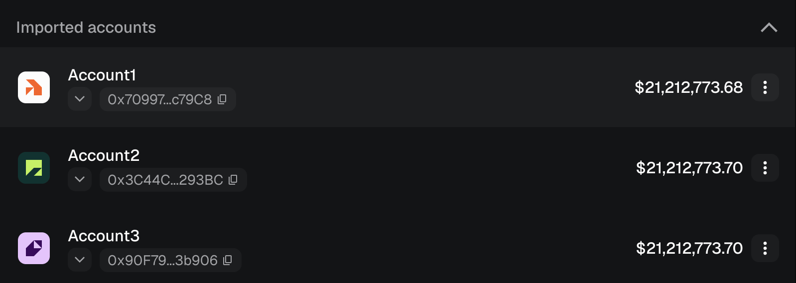
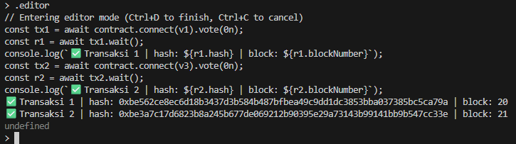

# VotingARA - Smart Contract (Blockchain Project #2)

## Deskripsi

Project VotingARA adalah smart contract voting on-chain untuk pemilihan Project Officer ARA 8.0 dengan sistem weighted voting, quorum 30% per entitas, deadline voting, dan finalisasi hasil.

## Anggota Kelompok

- Hazwan Adhikara Nasution (5027231017)
- Hafiz Akmaldi Santosa (5027221061)

## Fitur Wajib 

| Fitur | Keterangan |
| ----- | ---------- |
| Owner membuat kandidat | Owner dapat menambahkan kandidat selama voting aktif |
| Voting satu kali per voter | Setiap voter hanya dapat memilih sekali, error `AlreadyVoted` jika mencoba ulang |
| Menampilkan hasil voting | `getWinner()`, `getAllCandidates()`, `getTotalWeightedVotes()` |
| Event saat vote | Event `Voted(voter, candidateId, weight, entity)` dikirim tiap vote |

## Fitur Bonus 

| Fitur | Keterangan |
| ----- | ---------- |
| **Deadline voting** | Owner set durasi via `setDeadline(seconds)`, voting otomatis berakhir |
| **Minimum quorum** | Quorum 30% dari tiap entitas harus terpenuhi sebelum finalisasi |
| **Weighted voting** | FUNGSIONARIS = bobot 3, WARGA_HMIT = bobot 2, ANGKATAN_2025 = bobot 1 |
| **Batch register** | Owner bisa daftarkan banyak voter sekaligus via `registerVotersBatch()` |
| **Custom errors** | Gas-efficient custom errors (Solidity 0.8.20+) |
| **NatSpec comments** | Seluruh fungsi terdokumentasi dengan NatSpec |

## Arsitektur Contract

```
VotingARA
├── Enums
│   └── EntityType          → FUNGSIONARIS | WARGA_HMIT | ANGKATAN_2025
├── Structs
│   ├── Candidate           → id, name, division, voteWeight, voteCount
│   └── Voter               → isRegistered, hasVoted, entity, votedCandidateId
├── Constants
│   ├── WEIGHT_FUNGSIONARIS  = 3
│   ├── WEIGHT_WARGA_HMIT    = 2
│   ├── WEIGHT_ANGKATAN_2025 = 1
│   └── QUORUM_THRESHOLD     = 30 (%)
├── Modifiers
│   ├── onlyOwner
│   ├── votingActive
│   ├── votingEnded
│   └── onlyRegisteredVoter
└── Events
    ├── CandidateAdded(candidateId, name, division)
    ├── VoterRegistered(voter, entity)
    ├── Voted(voter, candidateId, weight, entity)
    ├── VotingFinalized(winnerId, winnerName, totalWeightedVotes)
    └── DeadlineSet(deadline)
```

## Mekanisme Voting

1. **Setup** — Owner set deadline, tambah kandidat, dan daftarkan voter ke entitas masing-masing.
2. **Voting** — Voter terdaftar memanggil `vote(candidateId)`. Bobot suara dihitung otomatis berdasarkan entitas.
3. **Quorum Check** — Minimal 30% dari tiap entitas harus sudah vote.
4. **Finalisasi** — Setelah deadline lewat dan quorum terpenuhi, owner panggil `finalize()` untuk mengunci pemenang.
5. **Hasil** — Pemenang dilihat via `getWinner()`.

```
Contoh perhitungan bobot:
  2 FUNGSIONARIS vote kandidat A → +6 weighted votes
  3 WARGA_HMIT   vote kandidat B → +6 weighted votes
  5 ANGKATAN_2025 vote kandidat A → +5 weighted votes
  ────────────────────────────────────────────────────
  Kandidat A: 11 weighted votes  ← MENANG
  Kandidat B:  6 weighted votes
```

## Cara Menjalankan

### Prerequisites

- Node.js v18+
- npm atau pnpm
- MetaMask

### Installation

```bash
npm install
```

### Compile

```bash
npm run compile
```

### Test

```bash
npm test
```

### Deploy (Local)

**Terminal 1** — Jalankan local node:
```bash
npx hardhat node
```

**Terminal 2** — Deploy contract (otomatis setup deadline + kandidat + 15 voter):
```bash
npm run deploy:localhost
```

Lalu ambil contract address dari output deploy, kemudian jalankan console:

```bash
npx hardhat console --network localhost
```

Lanjutkan langkah voting sesuai `logictest.md`.

### Interact (Opsional)

```bash
npm run interact:localhost
```

## Contract Address

Setelah deploy ke localhost, address muncul di output terminal:

```
VotingARA deployed by 0xf39Fd6e51aad88F6F4ce6aB8827279cffFb92266
Contract address: 0x5FbDB2315678afecb367f032d93F642f64180aa3
```

> ⚠️ Address di atas adalah contoh — jalankan `npm run deploy:localhost` untuk mendapatkan address aktual.

## Koneksi MetaMask ke Hardhat Local

1. Install MetaMask dari Chrome Web Store
2. Buka MetaMask → network dropdown → **Add a custom network**
3. Isi data network:
   - **Network name:** `Hardhat Local`
   - **RPC URL:** `http://127.0.0.1:8545`
   - **Chain ID:** `31337`
   - **Currency symbol:** `ETH`
4. Klik **Save**
5. Import akun: MetaMask → avatar kanan atas → **Import account** → masukkan private key dari output `npx hardhat node`
6. Berhasil jika saldo muncul `10000 ETH` di network **Hardhat Local**

## Screenshot

### Compile Berhasil


### Hardhat Node Berjalan


### Test Passing (19/19)


### Deploy Berhasil


### MetaMask Connected (Hardhat Local)



### Transaksi Berhasil



### State Berubah (Setelah Vote)

**Sebelum Voting**


**Sesudah Voting**


## Referensi

- [Solidity Documentation](https://docs.soliditylang.org/)
- [Hardhat Documentation](https://hardhat.org/docs)
- [Ethers.js v6 Documentation](https://docs.ethers.org/v6/)